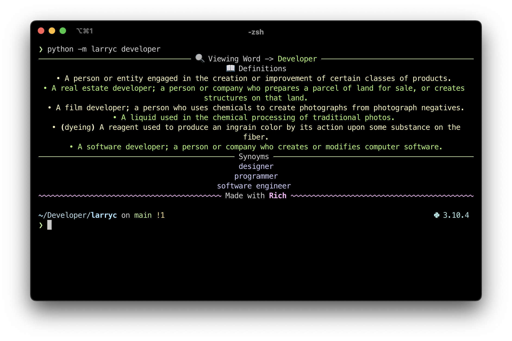

# Larryc

[](https://pepy.tech/project/larryc)
[](https://pypi.org/project/larryc/)




Larryc is an asynchronous dictionary-search engine that runs in your terminal with a pleasing UI. It is depending on the [dictionary api](https://dictionaryapi.dev/). And, the UI is written using the [Rich framework](https://github.com/Textualize/rich).

<br>

## Motivation
First of all, nobody these days carries dictionaries. Second of all, not everyone likes to use the browser for everything. Especially me. I feel like small things like this should be done in the terminal, which is fast and straight to point. Larryc is **maybe** going to solve the *dictionary* crysis. That's what I'm calling it. 

<br>

## Installation & Usage
- Cross-platform (Python must be installed):
```bash
# Install the package (pip required).
pip install larryc

# Basic command-line usage.
python -m larryc archeology # You can use any word in place of archeology here.
```

<br>

## Contribution
Contributing to Larryc is pretty straight-forward. If you're up to creating some new features for the projects or make a massive change, here are the simple steps to follow:

- [Fork]() the repository and clone it.
- Do your stuff.
- [Push]() your changes to the fork.
- [Create a pull request]() and submit!

<br>

## Developer Notes
In order to set up the development environment for this library, consider [cloning the repository](https://docs.github.com/en/repositories/creating-and-managing-repositories/cloning-a-repository) and installing the dependencies for it first using the commands below. The tests for this project have been written to support [pytest](https://pytest.org).

```bash
# The tests/requirements.txt text file contains the dependency names.
pip install -r tests/requirements.txt

# Run the tests with the pytest command, --verbose flag to show detailed output.
python3 -m pytest --verbose
```

<br>

## License
```
MIT License

Copyright (c) 2022 furtidev, HitBlast

Permission is hereby granted, free of charge, to any person obtaining a copy
of this software and associated documentation files (the "Software"), to deal
in the Software without restriction, including without limitation the rights
to use, copy, modify, merge, publish, distribute, sublicense, and/or sell
copies of the Software, and to permit persons to whom the Software is
furnished to do so, subject to the following conditions:

The above copyright notice and this permission notice shall be included in all
copies or substantial portions of the Software.

THE SOFTWARE IS PROVIDED "AS IS", WITHOUT WARRANTY OF ANY KIND, EXPRESS OR
IMPLIED, INCLUDING BUT NOT LIMITED TO THE WARRANTIES OF MERCHANTABILITY,
FITNESS FOR A PARTICULAR PURPOSE AND NONINFRINGEMENT. IN NO EVENT SHALL THE
AUTHORS OR COPYRIGHT HOLDERS BE LIABLE FOR ANY CLAIM, DAMAGES OR OTHER
LIABILITY, WHETHER IN AN ACTION OF CONTRACT, TORT OR OTHERWISE, ARISING FROM,
OUT OF OR IN CONNECTION WITH THE SOFTWARE OR THE USE OR OTHER DEALINGS IN THE
SOFTWARE.
```
[View Original](LICENSE)
